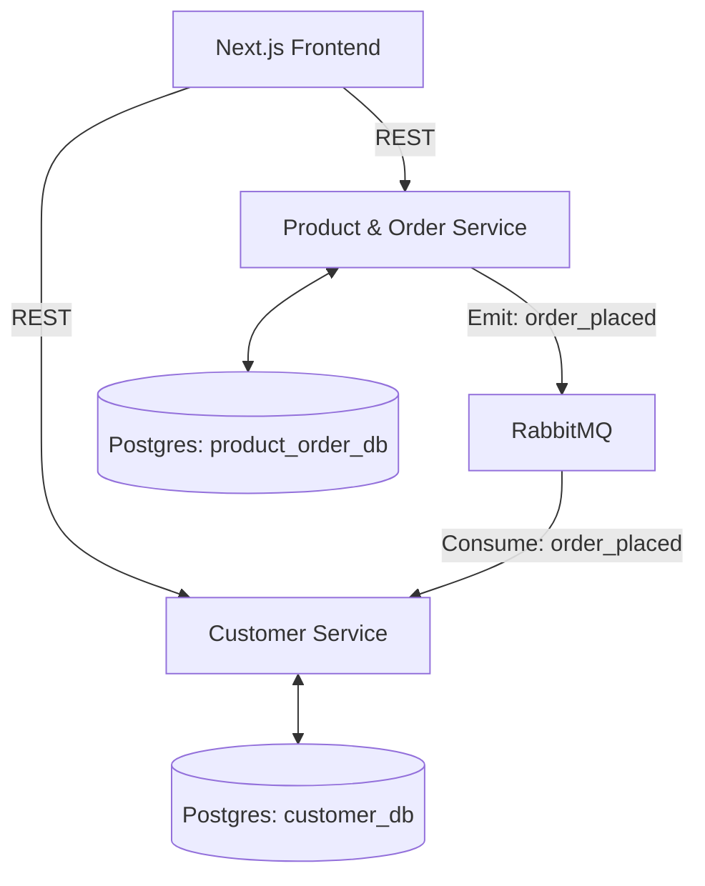

# E-Commerce System – NestJS Microservices

A full-stack e-commerce system built with **NestJS** microservices, **PostgreSQL**, **RabbitMQ**, and **Next.js**.

## 🏗️ System Architecture

The system consists of two independent microservices communicating via event-driven architecture through RabbitMQ.



- **Product & Order Service**: Manages product inventory and handles order creation.
- **Customer Service**: Manages customer profiles and maintains synchronized order history.
- **RabbitMQ**: Acts as the message broker for asynchronous data synchronization.

---

## 🚀 Quick Start

### 1. Start Infrastructure (Docker)
From the root directory, start PostgreSQL and RabbitMQ:
```bash
docker-compose up -d
```
*Wait for RabbitMQ to be fully ready before starting services.*

### 2. Service Setup
Each service requires a `.env` file (see examples in the README inside `ecommerce-nestjs-microservices`).

#### **Product & Order Service (Port 3001)**
```bash
cd services/product-order-service
npm install
npm run start:dev
```

#### **Customer Service (Port 3002)**
```bash
cd services/customer-service
npm install
npm run start:dev
```

#### **Frontend (Port 3000)**
```bash
cd frontend/web
npm install
npm run dev
```

---

## 🧪 How to Demo the Flow

1.  **Seed Products**: Use an API client (like Postman or cURL) to add a few products to the Product Service.
    ```bash
    curl -X POST http://localhost:3001/products \
    -H "Content-Type: application/json" \
    -d '{"name": "Gaming Laptop", "price": 1299.99, "stock": 10, "description": "High performance"}'
    ```
2.  **Browse Products**: Open `http://localhost:3000` to see your laptop.
3.  **Add to Cart**: Click "Add to Cart".
4.  **Checkout**: 
    - Go to the Cart.
    - Enter customer details (Name, Email, Address).
    - Click "Place Order".
5.  **Verify Sync**: 
    - The browser will redirect you to the History page.
    - Select your customer from the dropdown.
    - **Result**: You will see the order details. This data was successfully emitted from the Product service and stored in the Customer service via **RabbitMQ**!

---

## 🛠️ API Documentation

### **Product & Order Service** (Port 3001)
- `GET /health`: Health check
- `GET /products`: List all products
- `POST /products`: Create product
- `GET /orders`: List all orders
- `POST /orders`: Place order (Body: `{ customerId, items: [{ productId, quantity }] }`)

### **Customer Service** (Port 3002)
- `GET /health`: Health check
- `GET /customers`: List all customers
- `POST /customers`: Create customer
- `GET /customers/:id/history`: View synced order history

---

## 📚 API Documentation (Swagger)

Both services include interactive Swagger documentation:

- **Product & Order Service**: `http://localhost:3001/api`
- **Customer Service**: `http://localhost:3002/api`

Access the Swagger UI to explore endpoints, test APIs, and view request/response schemas.

## 🔧 Environment Configuration

The project supports multiple environment files for different deployment stages:

- `.env` - Base configuration
- `.env.dev` - Development overrides
- `.env.qa` - QA environment
- `.env.production` - Production configuration
- `.env.local` - Local overrides (gitignored)

Set the environment using:
```bash
APP_ENV=dev npm run start:dev
APP_ENV=qa npm run start:dev
APP_ENV=production npm run start:prod
```

See `services/ENV_FILES.md` for detailed documentation.

## 🗄️ Database Migrations

Both services use TypeORM migrations for schema management:

```bash
# Generate migration
npm run migration:generate

# Run migrations
npm run migration:run

# Revert last migration
npm run migration:revert

# Show migration status
npm run migration:show
```

## ✅ Deliverables Status
- [x] Two NestJS Microservices
- [x] PostgreSQL Integration (Isolated DBs)
- [x] RabbitMQ Event-Driven Sync
- [x] Next.js Frontend (Cart, Checkout, History)
- [x] Docker Compose Setup
- [x] Swagger API Documentation
- [x] TypeORM Migrations
- [x] Multi-Environment Configuration
- [x] Global Validation Pipes
- [x] Architecture Documentation
